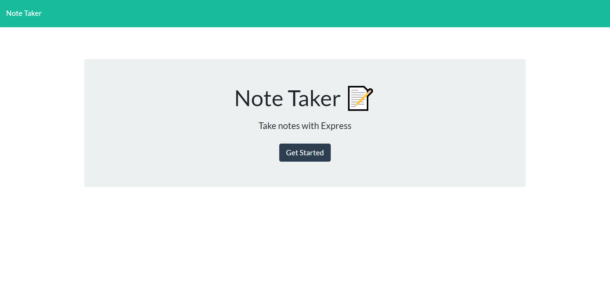

# NoteTaker

In this repository I created an application that allows the user to create, view, edit, and delete notes. I used express.js to connect the backend to the front-end. Each note that the user adds is given a unique ID, which allows the backend to manipulate the notes appropriately.

